README.md

 <picture> <source media="(prefers-color-scheme: dark)" srcset="./dark.svg"> <source media="(prefers-color-scheme: light)" srcset="./light.svg">  </picture> 

About
I'm Aakash Singh, a m.tech cse student · ai/ml engineer · software developer based in India.

I enjoy building software across AI/ML, LLM applications, full-stack development, APIs, and data-driven systems.

Focus
Artificial Intelligence & Machine Learning

NLP, LLMs and RAG

Full-stack application development

Backend APIs and data systems

Algorithms, data structures and problem solving

Engineering Stack
Languages: C++, Python, JavaScript, TypeScript, SQL

Frontend: React, Next.js

Backend: FastAPI, .NET, Node.js

Data: PostgreSQL, MongoDB

AI/ML: Machine Learning, NLP, LLMs, RAG

Tools: Git, Linux

Selected Projects
Project	Description
Autonix	AI-focused engineering project
IntelliPrep	Interview preparation platform
AI Interview Assistant	AI-assisted interview tooling
SkyKnow	Web application project
N-Queens Puzzle	Interactive algorithm visualizer
Connect

 <a href="https://github.com/singhakash006">GitHub</a> · <a href="https://www.linkedin.com/in/singh-aakash-">LinkedIn</a> · <a href="https://tinyurl.com/aakash06">Portfolio</a> · <a href="mailto:singhakash6203@gmail.com">Email</a> 

 Built with a terminal-inspired SVG profile system. 
